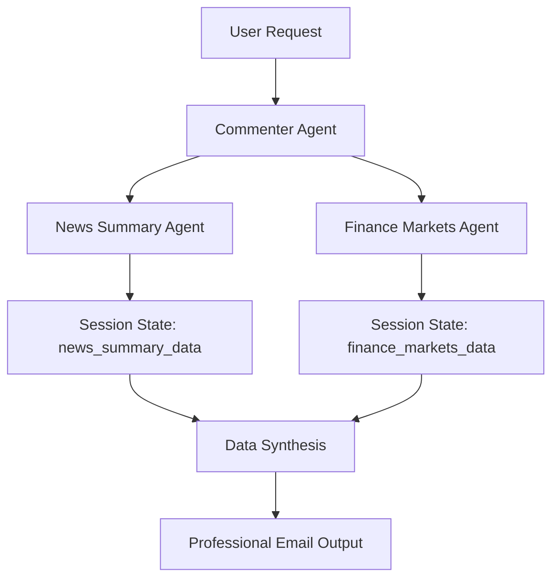

# Commentary Mode - Professional Financial Market Analysis

## Overview

The Commentary Mode is a sophisticated financial market analysis system built using Google's Agent Development Kit (ADK). It orchestrates real-time data gathering from multiple sources to create comprehensive, email-ready market commentary for institutional clients and financial advisors.

## Architecture

### Core Components

#### 1. Commenter Agent (`agent.py`)
- **Role**: Primary orchestrator and content synthesizer
- **Model**: `gemini-2.5-flash`
- **Responsibilities**:
  - Workflow coordination
  - Data integration and synthesis
  - Professional content generation
  - Email formatting and presentation

#### 2. Subagents

##### News Summary Agent (`subagents/newssummary/`)
- **Purpose**: Gathers and processes real-time financial news
- **Data Sources**:
  - Yahoo Finance RSS feeds
  - Financial news aggregators
  - Real-time market updates
- **Features**:
  - Content scraping and extraction
  - Article summarization
  - Relevance filtering
  - Time-sensitive data collection

##### Finance Markets Agent (`subagents/financemarkets/`)
- **Purpose**: Collects comprehensive market data
- **Data Sources**:
  - Yahoo Finance API (yfinance)
  - Major market indices
  - Forex pairs
  - Cryptocurrency markets
  - Commodity futures
- **Features**:
  - Real-time price data
  - Percentage change calculations
  - Multi-asset coverage
  - Historical comparison

## Data Flow Architecture



## State Management

The commentary system uses session state for data persistence:

```python
{
    "commentary_state": True,           # Commentary mode active
    "finance_markets_data": {},         # Market data from Finance Markets Agent
    "news_summary_data": {},            # News data from News Summary Agent
}
```

## Workflow Process

### 1. Data Collection Phase
```
Step 1: Call News Summary Agent
Step 2: Call Finance Markets Agent
Step 3: Verify data in session state
```

### 2. Data Validation Phase
```
- Check finance_markets_data completeness
- Verify news_summary_data availability
- Ensure data freshness and relevance
```

### 3. Content Generation Phase
```
- Synthesize market data
- Integrate news insights
- Format professional email
- Apply institutional standards
```

## Output Format

### Professional Email Structure

#### Header
```
📈 **DAILY MARKET COMMENTARY** 📈
```

#### Market Performance Summary
- Key market movements overview
- Major indices performance
- Commodity price changes
- Forex market updates
- Cryptocurrency movements
- Professional financial terminology
- Actual data only (no fabrication)

#### News Highlights
- Top 2-3 relevant financial stories
- Bullet point format
- Connection to market movements
- Professional presentation
- Source-verified content

#### Market Outlook
- Brief professional insights
- Key factors to monitor
- Informative and professional tone
- Data-driven observations

## Data Sources & Coverage

### Market Data Coverage

#### Equity Indices
- S&P 500, NASDAQ, Dow Jones
- International indices
- Sector-specific indices

#### Forex Pairs
- Major pairs (EUR/USD, USD/JPY, GBP/USD)
- Cross currencies
- Emerging market currencies

#### Commodities
- Precious metals (Gold, Silver)
- Energy futures (Oil, Natural Gas)
- Agricultural commodities

#### Cryptocurrencies
- Bitcoin, Ethereum
- Major altcoins
- Market cap analysis

### News Sources
- Yahoo Finance RSS feeds
- Real-time financial news
- Market analysis articles
- Economic announcements

## Technical Implementation

### News Summary Agent Features

#### Content Extraction
```python
async def news_summary(tool_context: ToolContext, num_articles: int = 5)
```
- RSS feed parsing
- Full article content retrieval
- HTML content cleaning
- Content summarization

#### Data Processing
- BeautifulSoup for HTML parsing
- Requests for content fetching
- Feedparser for RSS processing
- Time-based filtering

### Finance Markets Agent Features

#### Market Data Collection
```python
async def get_finance_markets(tool_context: ToolContext, custom_instruments: str = "")
```
- yfinance API integration
- Multi-asset data retrieval
- Percentage change calculations
- Historical data comparison

#### Data Analysis
- Last 2 trading days comparison
- Recent news integration (8-hour window)
- Category-based organization
- Performance metrics calculation

## Error Handling & Reliability

### Data Validation
- Source availability checks
- Data completeness verification
- Timeout handling
- Fallback mechanisms

### Content Quality Assurance
- No fabricated financial data
- Source attribution
- Professional language standards
- Accuracy validation

### System Resilience
- Graceful degradation
- Error recovery procedures
- Alternative data sources
- User notification protocols

## Configuration & Customization

### Configurable Parameters

#### News Collection
- Number of articles to process
- Time window for news relevance
- Source priorities
- Content filtering criteria

#### Market Data
- Asset coverage list
- Update frequency
- Historical comparison periods
- Custom instrument support

#### Output Formatting
- Email template customization
- Branding options
- Content section ordering
- Professional styling

## Performance Optimization

### Caching Strategy
- Market data caching
- News content storage
- Session state optimization
- Response time improvement

### Parallel Processing
- Simultaneous data collection
- Agent tool coordination
- Asynchronous operations
- Resource utilization

## Integration Capabilities

### Email Systems
- SMTP integration (planned)
- Template management
- Distribution lists
- Scheduling capabilities

### External APIs
- Financial data providers
- News aggregation services
- Market analysis platforms
- Real-time data feeds

### Institutional Systems
- CRM integration
- Portfolio management systems
- Risk management platforms
- Compliance reporting

## Security & Compliance

### Data Protection
- Secure API key management
- Data encryption in transit
- Session data protection
- Access control mechanisms

### Financial Regulations
- Compliance with financial reporting standards
- Disclaimer requirements
- Data accuracy obligations
- Professional standards adherence

## Development Guidelines

### Adding New Data Sources
1. Implement data collection function
2. Update session state structure
3. Modify synthesis logic
4. Test data integration
5. Update documentation

### Enhancing Content Quality
1. Improve natural language processing
2. Add market sentiment analysis
3. Enhance correlation detection
4. Implement trend analysis

### Extending Output Formats
1. Add new template options
2. Implement multi-format support
3. Create visualization capabilities
4. Enable interactive content

## Troubleshooting

### Common Issues

#### Data Collection Failures
- Network connectivity problems
- API rate limiting
- Source unavailability
- Content parsing errors

#### Content Quality Issues
- Missing market data
- Incomplete news coverage
- Formatting inconsistencies
- Professional tone deviation

#### Performance Problems
- Slow response times
- Memory usage issues
- Concurrent access conflicts
- Resource exhaustion

### Resolution Strategies
- Implement retry mechanisms
- Add fallback data sources
- Optimize caching strategies
- Monitor system resources

## Future Enhancements

### Advanced Analytics
1. Machine learning integration
2. Predictive market analysis
3. Sentiment analysis capabilities
4. Pattern recognition systems

### Enhanced Automation
1. Scheduled commentary generation
2. Event-triggered updates
3. Custom alert systems
4. Automated distribution

### Professional Features
1. Multi-language support
2. Regional market coverage
3. Sector-specific analysis
4. Client customization options

### Integration Expansion
1. Bloomberg terminal integration
2. Reuters data feeds
3. Institutional platform APIs
4. Regulatory reporting systems

## Usage Examples

### Basic Commentary Generation
```python
# Triggered via RootAgent
user_intent = "start_commentary"
# Activates data collection workflow
```

### Custom Market Focus
```python
# Modify collection parameters
custom_instruments = "AAPL,GOOGL,TSLA"  # Focus on specific stocks
```

### Professional Output
```python
# Generated email-ready content
final_commentary = session_state["final_commentary"]
```

This documentation should be maintained and updated as the Commentary Mode evolves and new capabilities are added.